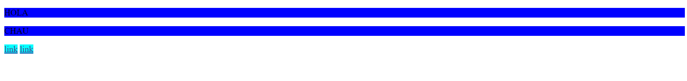
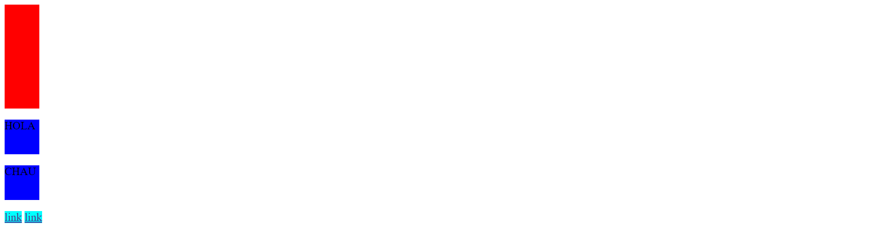
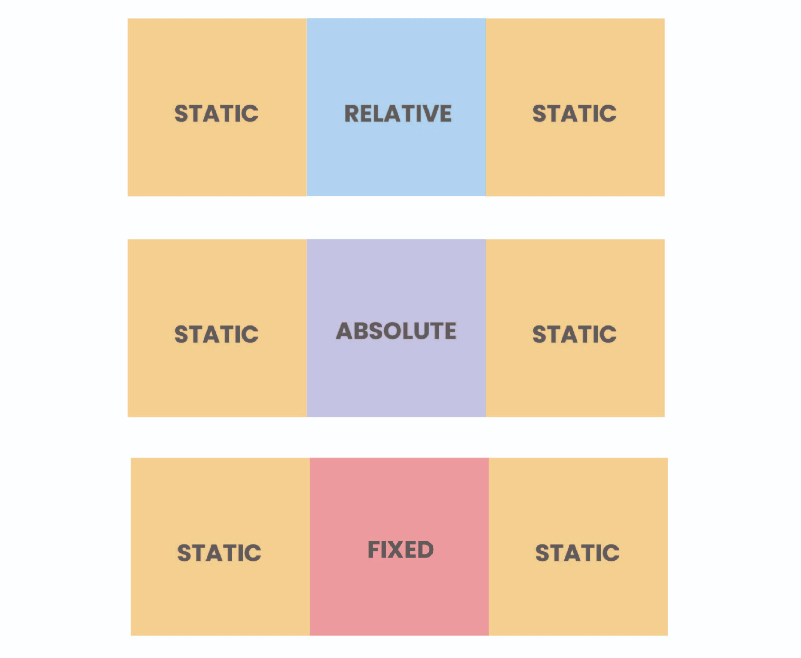

# clase_05
# 🏠 Paso 13 - ¡Introducción a posicionamiento en CSS!


## 👋 ¡Bienvenido a tu siguiente paso! 
¡Hola! Seguimos avanzando 👟

En los pasos previos vimos cómo ubicar elementos en la web con flexbox, que es una herramienta muy poderosa. 

Ahora bien, existen otras propiedades en CSS que veremos a continuación y que nos permitirán ubicar los elementos HTML donde deseemos y que podremos usar en ciertas ocasiones donde no logremos con flexbox la ubicación deseada. 

¿Listo? ¡Vamos! 🚀


Aquí es donde encontrarás el material descargable que complementará los ejercicios prácticos que vamos a ver en los siguientes pasos. 

Para tu encuentro en vivo te dejamos el siguiente material que te ayudará a profundizar en el contenido

👉 Posicionamiento en CSS

📢 ¡Importante!

No debes memorizar, concéntrate en entender el concepto. La práctica hará que luego puedas aplicarlo con más agilidad.

Si hay algo que no comprendes, ¡no te preocupes! Anótalo y pregunta a tus compañeros o mentor en el encuentro en vivo. 

Les dejamos este artículo acerca de centrar elementos con CSS 👉 Cómo Centrar Cualquier Cosa con CSS

Muchas veces suceden que existen ciertas estrategias que nos facilitan resolver temas recurrentes, cómo centrar elementos, por este motivo consideramos que tener cerquita el artículo anterior los puede ayudar a resolver estos temas.


Asegúrate de:

Descargar el material teórico

Leer el artículo sobre centrar elementos con CSS

# 👣 Paso 14 - Propiedades de display


## 👋 ¡Bienvenido a tu siguiente paso! 
En este paso practicaremos acerca de la propiedad de display. Flex, es uno de los atributos que ya vimos sobre esta propiedad. Ahora nos enfocaremos en entender los atributos inline, block e inline-block. 

Para ponerlo en términos sencillos, lo que permite la propiedad de display, es “pisar” el comportamiento original del elemento. 

Como vimos en html, los elementos se pueden comportar como bloques o en línea. Entonces, lo que me permite la propiedad de display es modificar ese comportamiento, y otorgarle un comportamiento en línea a un elemento de bloque, también hacerlo al revés o que tenga lo mejor de ambos, con la propiedad inline-block. 

¡Continuemos! 🚀

 Practicando la propiedad display
El objetivo de esta actividad es poder practicar la propiedad de display y ver cómo se comportan los elementos. 

✏️ Instrucciones 

1. Crea una carpeta con nombre 📂display, a la misma altura que la carpeta 📂mi_primera_web

2. Dentro de la carpeta 📂display, crea un archivo index.html, y coloca el siguiente código dentro. 
```
<!DOCTYPE html>
<html lang="en">
  <head>
    <meta charset="UTF-8" />
    <meta name="viewport" content="width=device-width, initial-scale=1.0" />
    <title>Document</title>
  </head>
  <body>
    <!-- elementos en bloque -->
    <div class="cuadrado"></div>
    <div class="cuadrado"></div>
    <div class="cuadrado"></div>


    <p>HOLA</p>
    <p>CHAU</p>


    <!-- elementos en línea -->
    <a href="">link</a>
    <a href="">link</a>
  </body>
</html>
```
3. Crear un archivo styles.css y linkea el mismo a tu archivo html

4. Colocar un color de fondo diferente para cada uno de los elementos: div, p y a. Deberías ver algo cómo esto.


📌 Hasta ahora, el div no aparece, ya que no tiene contenido dentro. 

5. Intenta colocar un ancho (width) y un alto (height) para cada uno los elementos. Deberías ver algo cómo esto

📌 Ahora podemos ver los divs porque colocamos un ancho y alto, pero ¿qué sucede con los elementos a? No toman las propiedades de ancho y alto ya que son elementos en línea

6. Agrega la propiedad display: block; a los elementos <a>. ¿Qué sucede? (debate con tus compañeros)

7. Agrega la propiedad display:inline; a los elementos <div>. ¿Qué sucede? (debate con tus compañeros)

8. Agrega la propiedad display:inline-block; a los elementos <p>. ¿Qué sucede? (debate con tus compañeros)

Deberías ver algo cómo esto


📌 Los divs desaparecen porque al colocarle comportamiento en línea ya no aceptan ancho y alto, los elementos tienen cuerpo porque les cambiamos la propiedad a bloque, y los elementos p, toman lo mejor de ambos casos, se comportan como un elemento en línea (uno al lado del otro), pero aceptan también las propiedades de ancho y alto. 

💡 Cuando todos hayan logrado seguir las instrucciones, de a uno vayan compartiendo pantalla mostrando su código y el resultado de su CSS.

# 👣 Paso 15 - Propiedad position

## 👋 ¡Bienvenido a tu siguiente paso! 
Llegó el momento de ver la propiedad de position, y sus valores relative, absolute, fixed, sticky.

¡Continuemos! 🚀


## Practicando la propiedad position
El objetivo de esta actividad es poder practicar la propiedad de position y ver cómo se comportan los elementos. 

✏️ Instrucciones 

Para entender cómo funcionan la propiedad position en CSS, vamos a despegarnos un poco del sitio que venimos armando y vamos a practicar por fuera, para ello, sigue estos pasos:

1. Crea una carpeta llamada 📂 position a la misma altura que la carpeta 📂 display, dentro de la carpeta 📂 position coloca un archivo llamado position.html y pega el siguiente HTML.
```
<!DOCTYPE html>
<html>
  <head>
    <meta charset="UTF-8" />
    <title>Posicionando elementos!</title>
    <link href="styles.css" rel="stylesheet" />
  </head>
  <body>
    <div class="container">
      <div class="ejemplo relative">
        <div class="item"></div>
        <div class="item item-relative">
          
        </div>
        <div class="item"></div>
      </div>
    </div>

    <div class="container">
      <div class="ejemplo absolute">
        <div class="item"></div>
        <div class="item item-absolute">
          
        </div>
        <div class="item"></div>
      </div>
    </div>

    <div class="container">
      <div class="ejemplo fixed">
        <div class="item"></div>
        <div class="item item-fixed"></div>
        <div class="item"></div>
      </div>
    </div>
  </body>
</html>
```
2. Dentro de la carpeta 📂 position guarda la 👉 siguiente carpeta que contiene las imágenes que vamos a utilizar (esta carpeta se llama images)

3. Crear el archivo styles.css que ya se encuentra vinculado en el html y colca el siguiente css.
```
* {
  margin: 0;
  padding: 0;
  box-sizing: border-box;
}

body {
  height: 1200px;
}

.container {
  display: flex;
  justify-content: center;
}

.ejemplo {
  display: flex;
  justify-content: space-around;

  width: 800px;
  margin: 50px 0;
  background-color: #d6e9fe;
}

.item img {
  display: block;
}
```
📌 Veremos algo así

Ahora vamos a comenzar a mover los elementos para visualizar las diferentes posiciones. 

➕ Static: es la posición por defecto, es la que tienen los elementos naturalmente. 

➕ Position Relative: el elemento se ubica en una posición relativa a su posición original. 

4. Aplica el siguiente CSS y observa cómo se muve la imagen relative .
```
.item-relative {
  position: relative;
  top: 30px;
  left: 30px;
}
```
💡Lo bueno de la propiedad position es que podemos mover el elemento a través de las propiedades top, left, right, bottom.


Haz la prueba cambiando top y left por bottom y right. 

➕ Position Absolute: el elemento se salta el flujo y se ubica en relación a la ventana del navegador

5. Aplica el siguiente CSS y observa cómo se mueve la imagen con position:absolute;

```
.item-absolute {
  position: absolute;
  top: 10px;
  left: 10px;
}
```
6. Vamos a aplicar el siguiente CSS al contenedor padre del elemento absolute.

```
.container .absolute {
  position: relative;
}
```
💡 De esta manera es como combinamos la posición absoluta con la posición relativa.


➕ Position Fixed: el elemento se salta el flujo y se ubica en relación a la ventana del navegador al igual que en absolute, pero la diferencia es que al hacer scroll, elemento queda fijo y no se mueve

7. Aplica el siguiente CSS y observa cómo se ubica la imagen con  position:fixed;

```
.item-fixed {
  position: fixed;
  bottom: 0;
  right: 0;
}
```
🖥️ Cuando todos hayan logrado seguir las instrucciones, de a uno vayan compartiendo pantalla mostrando su código y el resultado de su CSS.

Para tener en cuenta 

* display es una propiedad que nos permite modificar el comportamiento de los elementos html, y “pisar” su comportamiento original 

* position es una propiedad que permite modificar la ubicación de los elementos en el espacio y quebrar su dinámica natural.