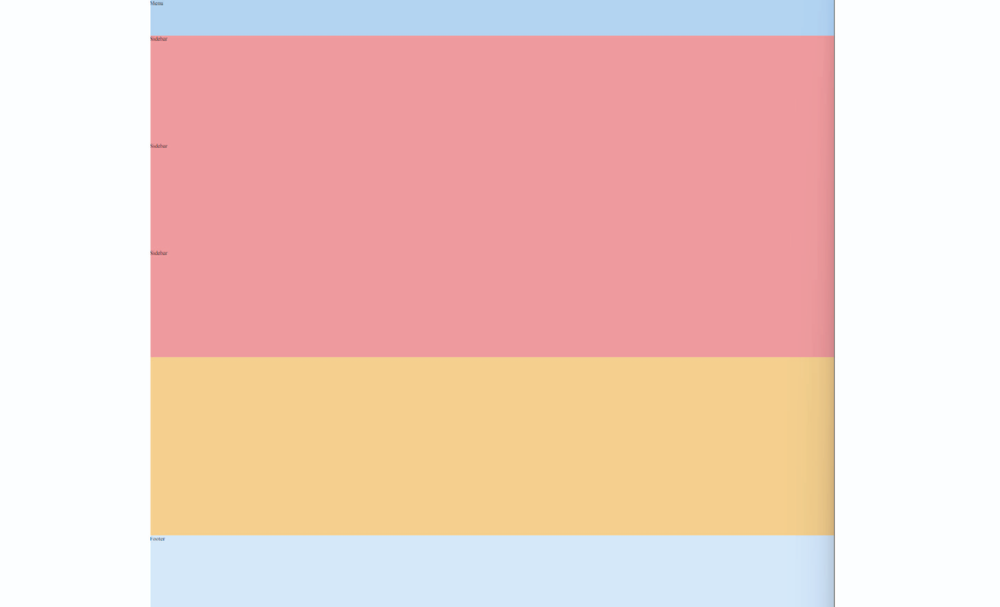
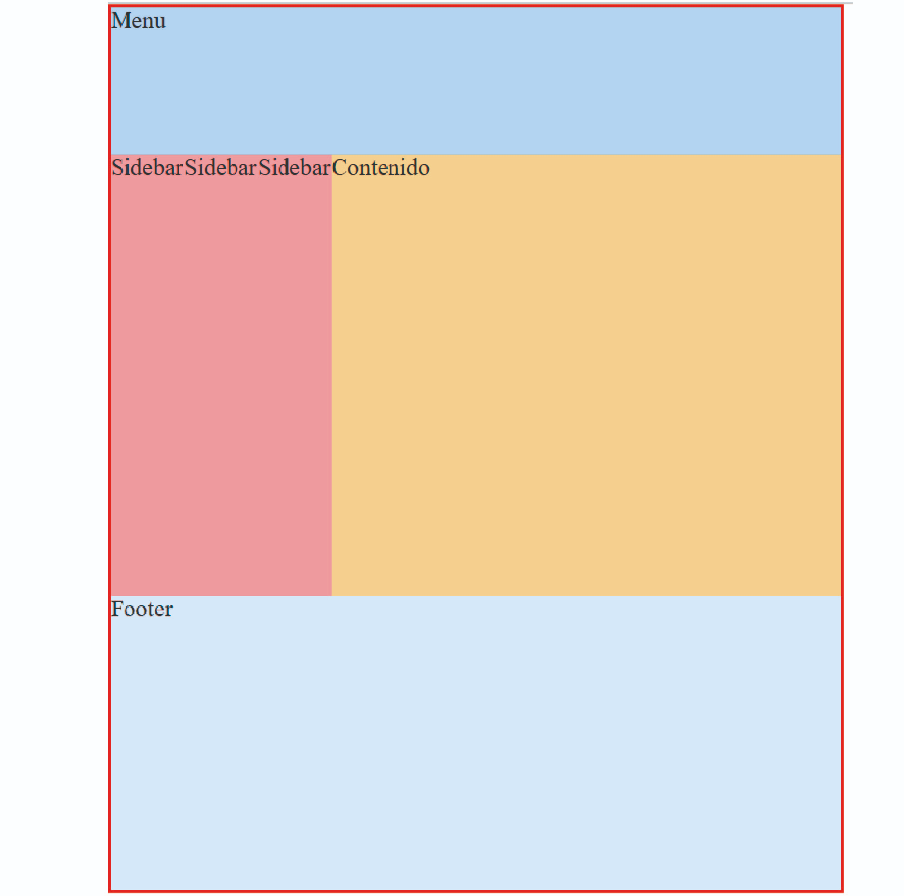
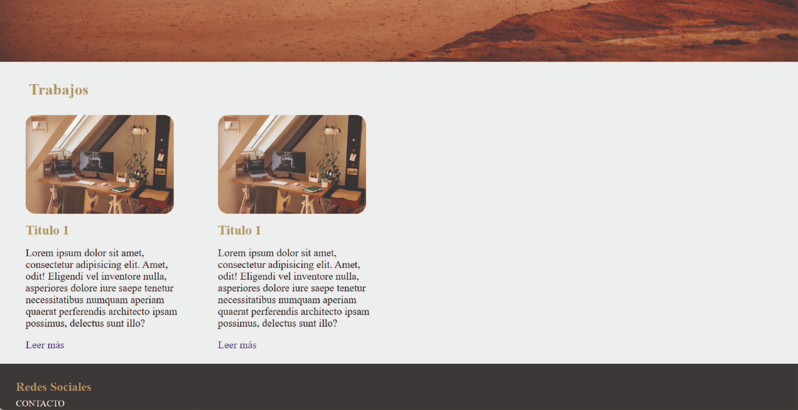

# clase_05
# 🏠 Paso 13 - ¡Introducción a posicionamiento en CSS!


## 👋 ¡Bienvenido a tu siguiente paso! 
¡Hola! Seguimos avanzando 👟

En los pasos previos vimos cómo seleccionar elementos con CSS y aplicar estilos a tu web, cómo color de fondo, tamaño y tipo de fuente, margin, padding, etc. 

Pero, hasta ahora, toda la información está orientada a la izquierda. ¿Cómo hacemos entonces para ubicar los elementos en diferentes lugares?

Bien, para ello existen diferentes propiedades en CSS que veremos a continuación y que nos permitirán ubicar los elementos HTML donde deseemos. 

¿Listo? ¡Vamos! 🚀

## 📖 Material descargable
Aquí es donde encontrarás el material descargable que complementará los ejercicios prácticos que vamos a ver en los siguientes pasos. 

Para tu primer encuentro en vivo tienes que leer solo el material que te compartimos a continuación 👉 Posicionamiento en CSS

## 📢 ¡Importante!

* No debes memorizar, concéntrate en entender el concepto. La práctica hará que luego puedas aplicarlo con más agilidad.

* Si hay algo que no comprendes, ¡no te preocupes! Anótalo y pregunta a tus compañeros en el encuentro en vivo.

✍️ Para tu próximo encuentro en vivo
En esta oportunidad les vamos a solicitar que:

* Vean los siguientes videos sobre las propiedades de ordenamiento y posicionamiento en CSS.

👉 Propiedad float 
https://youtu.be/wLMENRMUsj8?si=C_JE1QkpfJQvLIcD

👉 Propiedad display
https://youtu.be/eNiIM4r7-Qc?feature=shared

👉 Propiedad position
https://youtu.be/w_mJaFQ7wvg?feature=shared

* Lean este artículo acerca de centrar elementos con CSS (se van a mencionar propiedades como display flex que veremos más adelante) 👉Como Centrar Cualquier Cosa con CSS
https://www.freecodecamp.org/espanol/news/centrar-en-html-div-con-css/ 

📌 La propiedad position la vamos a ver en unos pasos más adelante, pero es bueno que ya vayan familiarizándose con el concepto. 

✅ Checklist
Asegúrate de:

Ver los videos que les indicamos previamente

Leer el artículo sobre centrar elementos con CSS

💡 Revisar estos puntos es muy importante dado que ayudarán a que todos puedan tener la mejor experiencia posible y logren resolver los desafíos correspondientes.

Si queres colaborar o sugerir algun cambio en este paso, hacelo 👉 aquí.


# 👣 Paso 14 - ¡A trabajar en equipo!


## 👋 ¡Bienvenido a tu siguiente paso! 
¡Llegó el momento de organizar los elementos HTML! Para ello vamos a ver y utilizar las propiedades de float y display. 

🛑✋ Momento, antes de continuar, validen: ¿todos vieron los videos y leyeron el artículo indicado en el paso previo? Si no es así, tómense el tiempo de realizar este paso y sacarse las dudas porque ¡lo vamos a necesitar!. Si encuentran alguna dificultad, recuerden que pueden llamar al mentor para sacarse las dudas. 

¡Continuemos! 🚀

💡 Para este paso, les vamos a pedir que:

🔸Resuelvan individualmente el ejercicio en su propia computadora.

🔸Preguntar a tus compañeros en caso de no entender alguna parte. 

🔸Si no logran resolver algo entre todos, no olviden llamar al mentor para que los ayude. 

📌 ¡Recuerden mantener las cámaras encendidas en todo el proceso! ¡Sé protagonista de tus objetivos!

## ✏️ Actividad - Entendiendo los floats

Para entender cómo funcionan los floats en CSS, vamos a despegarnos un poco del sitio que venimos armando y vamos a practicar por fuera, para ello, sigue estos pasos:

1. Crea una carpeta llamada floats (al mismo nivel que la carpeta mi_primera_web), dentro de ella coloca un archivo llamado floats.html y pega el siguiente HTML

```
<!DOCTYPE html>
<html lang="en">
  <head>
    <meta charset="UTF-8" />
    <title>Floats</title>
    <link rel="stylesheet" href="styles.css" />
  </head>
  <body>
    <div class="pagina">
      <div class="menu">Menu</div>
      <div class="barra-lateral">Sidebar</div>
      <div class="barra-lateral">Sidebar</div>
      <div class="barra-lateral">Sidebar</div>
      <div class="contenido">Contenido</div>
      <div class="pie">Footer</div>
    </div>
  </body>
</html>

```

📌 Lo que estamos haciendo con este código es simular un sitio de manera muy sencilla, pensando el sitio como un conjunto de cajas que podrían contener más información dentro.

2. Crear el archivo styles.css (que ya se encuentra linkeado al html que creamos)

3. Dentro del archivo styles coloca el css para resetear estilos (si no recuerdas cuál es lo dejamos a continuación)
```
* {
  margin: 0;
  padding: 0;
  box-sizing: border-box;
}

```

4. Agrega un color de fondo diferente para cada uno de los elementos html menu, barra-lateral, contenido, pie (recuerden revisar el nombre de la clase en html)

5. Agrega alturas diferentes para cada elemento

Menu: height: 100px;

Barra-lateral: height: 300px;

Contenido: height: 500px;

Pie: height: 200px;

🛑✋Hasta aquí: deberían ver algo así. Recordemos que todos los elementos div, son elementos de bloque por default, con lo cual ocuparán todo el ancho de la pantalla.



Continuemos 🚀

6. Agreguen un ancho de 200px al elemento con clase barra-lateral, vean qué sucede. ¿Los elementos se reacomodan o quedan en su lugar?

7.  Prueba ahora, colocar la propiedad float: left; (también al elemento barra-lateral) ¿Qué sucede?. Prueben también colocando float:right; y float:none;

```
💡Importante: Las cajas flotantes siempre se alinean a la izquierda o derecha de su elemento contenedor. En nuestro ejemplo, el elemento contenedor de la barra lateral es <div class=pagina>, el cual tiene el ancho de la ventana del navegador. Es por esto que nuestra barra lateral se encuentra flotando en el extremo izquierdo de la página

🛑✋Hasta aquí: Tenemos los elementos alineados a la izquierda y pareciera que están contenidos dentro del <div class="contenido">Contenido</div>
```
Ahora vean el siguiente video para ver cómo se comportan los floats cuando aplicamos más de uno:

https://youtu.be/Mf2stIUrTSY

8. Practica lo visto en el video para luego pasar al siguiente ejercicio, la página debería verse como en el siguiente ejemplo


🖥️ Cuando todos hayan logrado seguir las instrucciones, de a uno vayan compartiendo pantalla mostrando su código y el resultado de su CSS.

## ✏️ Actividad - Aplica floats a tu sitio
¡Ahora sí! Una vez que vimos cómo se comportan los floats, vamos a usarlo para diseñar nuestro sitio. En el paso anterior les pedimos que creen tarjetas que contenían imágenes y textos. 

Ahora intenta aplicar lo que vimos sobre flotar elementos, para que los mismos se vean así (una al lado de la otra).



💡Tip: si no sale directamente en la página busquen realizar una maqueta que sea similar al sitio para probar cómo funciona con menos elementos y luego sí aplicarlo a la web final. 

🖥️ Cuando todos hayan logrado seguir las instrucciones, de a uno vayan compartiendo pantalla mostrando su código y el resultado de su CSS.

✅ Checklist
Asegúrate de:

Entender y practicar el posicionamiento con float

Ponerlo en práctica en tu propia web

💡 Revisar estos puntos es muy importante dado que ayudarán a que todos puedan tener la mejor experiencia posible y logren resolver los desafíos correspondientes. 

Si queres colaborar o sugerir algun cambio en este paso, hacelo 👉 aquí.

# 👣 Paso 15 - ¡Continuamos con posicionamiento!

## 👋 ¡Bienvenido a tu siguiente paso! 
En este paso practicaremos acerca de la propiedad de display. Luego aplicaremos lo aprendido a tu web personal. 

¡Continuemos! 🚀

💡 Para este paso, les vamos a pedir que:

🔸Resuelvan individualmente el ejercicio en su propia computadora.

🔸Preguntar a tus compañeros en caso de no entender alguna parte. 

🔸Si no logran resolver algo entre todos, no olviden llamar al mentor para que los ayude. 

📌 ¡Recuerden mantener las cámaras encendidas en todo el proceso! ¡Sé protagonista de tus objetivos!

## ✏️ Actividad - Practicando la propiedad display
Dentro de las propiedades de display, la más utilizada es la de display:inline-block; Ya que esta propiedad otorga al elemento html la flexibilidad de comportarse como un elemento en linea, pero con las ventajas de un elemento en bloque, como colocar ancho, alto y márgenes a los mismos. 

Vamos a crear un menú de navegación externo a nuestra web, para luego poder aplicar los cambios en la misma 

Mira el siguiente video y luego sigue los pasos que te mostramos a continuación:

https://youtu.be/Db9Lu7Azm2U

1. Crea una carpeta llamada menu  (al mismo nivel que la carpeta floats), dentro de ella coloca un archivo llamado menu.html y pega el siguiente HTML

```
<!DOCTYPE html>
<html lang="en">
  <head>
    <meta charset="UTF-8" />
    <meta name="viewport" content="width=device-width, initial-scale=1.0" />
    <title>Document</title>
    <link rel="stylesheet" href="styles.css" />
  </head>
  <body>
    <header class="container-nav">
      <h1 class="logo">Logo</h1>
      <nav class="navbar">
        <ul class="nav-links">
          <li><a href="#">Home</a></li>
          <li><a href="#">Acerca de</a></li>
          <li><a href="#">Servicios</a></li>
          <li><a href="#">Contactos</a></li>
        </ul>
      </nav>
    </header>
  </body>
</html>
```
2. Crea el archivo styles.css y pega el siguiente CSS. Reemplaza los comentarios con las propiedades correspondientes

```
* {
  margin: 0;
  padding: 0;
  box-sizing: border-box;
  list-style: none;
  text-decoration: none;
}

header {
  background-color: #333;
  color: #fff;
  padding: 20px;
}

header h1.logo {
  font-size: 35px;
  font-weight: bold;
  /* Agregar propiedad de display */
  /* Agregar propiedad de line-height */
  padding: 0 50px;
}

header nav {
  /* Agregar propiedad de float */
}

nav ul li {
  /* Agregar propiedad de display */

  margin-right: 20px;
  /* Agregar propiedad de line-height */
}

nav a {
  color: #fff;
  text-decoration: none;
  padding: 5px;
}
nav a:hover {
  color: #1bf7de;
}


```
🖥️ Cuando todos hayan logrado seguir las instrucciones, de a uno vayan compartiendo pantalla mostrando su código y el resultado de su CSS.

## ✏️ Actividad - Aplica display al menú de navegación de tu sitio
¡Ahora sí! Es momento de aplicar lo aprendido a tu web. Posiciona el menú de navegación de tu web y la imagen con el texto centrado

Te quedará algo como esto:


🖥️ Cuando todos hayan logrado seguir las instrucciones, de a uno vayan compartiendo pantalla mostrando su código y el resultado de su CSS.

✅ Checklist
Asegúrate de:

Practicar las propiedades de float

Practicar las propiedades de display

💡 Revisar estos puntos es muy importante dado que ayudarán a que todos puedan tener la mejor experiencia posible y logren resolver los desafíos correspondientes. 

## 🔎 Resumen y buenas prácticas aprendidas
Las propiedades de display y float ayudan a organizar el contenido en la pantalla y nos permiten posicionar elementos.

Practica primero con estructuras de cajas simples y una vez que hayas entendido las reglas aplica lo aprendido a tu página web

Si no sabes exactamente cuánto lugar ocupa un elemento puedes utilizar la propiedad de background-color para revisar que espacio se pinta de color y así entender cómo se comporta el elemento

A todos los elemenetos html le podemos modificar su comportamiento de línea o bloque jugando con la propiedad de display. 

## 📓 Test
Por último, te proponemos realizar un muy breve test para poner a prueba los aprendizajes alcanzados. Vamos 🚀

📝 Realizar test
https://eggeducacion.typeform.com/to/bCwdNrxM#form_type=autoevaluacion&profile_id=65124ef5f615c80f596b9c98&step_id=3RKX1uke7QeZ1udXWSPH3e&module_id=1aVJePrGRBrkp5WrfPIzbW&section_id=58RLn6r8yPeKiexExFuAEF

⏭️ En el próximo encuentro continuaremos con posicionamiento y veremos las opciones que nos brinda la propiedad position, así como también flexbox. Que viene a solucionar muchos de los inconvenientes que tenemos con la propiedad float. Si queres colaborar o sugerir algun cambio en este paso, hacelo 👉 aquí.